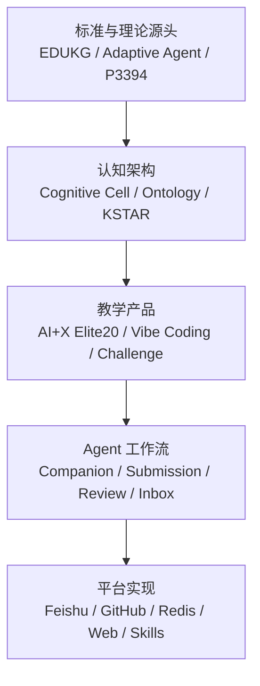
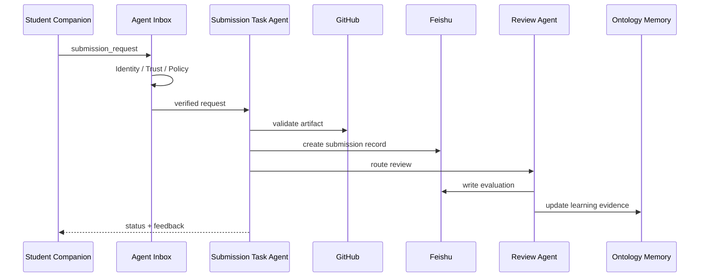

# Richard 资料合集：内容全景与理解报告

> 分析对象：`Richard资料合集.zip`  
> 原始大小：502,847,749 字节（约 480 MiB）  
> 归档项：约 10,686 条  
> 去除 `node_modules`、静态站点资源、macOS 元数据后：3,026 个文件  
> 深度解析：691 份内容文件（Markdown、Word、PDF、PPT、Excel、Skill、JSON、TeX 等）

## 一句话结论

这不是普通的“课程资料合集”，而是一套从教育标准、认知架构、教学方法、挑战式课程，到 Agent-native 教育平台实现的连续设计档案。

其核心目标是：

> 把“学习知识”改造成“用 AI 构建真实成果、沉淀可复用能力、形成个人认知资产”的过程，并把这套过程产品化为可部署、可审计、可演化的 AI Learning Operating System。

---

## 1. 资料全景

### 1.1 五个内容层



| 层次 | 主要内容 | 代表材料 |
|---|---|---|
| 标准层 | 教育知识图谱、适应性 Agent、Agent 互操作接口 | IEEE P2807.x、3428 Draft、P3394 Draft |
| 认知层 | Cognitive Cell、Ontology、Skill、Memory、Evaluation、KSTAR | `CognitiveCell.docx`、`Tech-discussions.docx` |
| 课程层 | Elite20、AI+X、Vibe Coding、项目制学习 | `Elite20-Vibe-Coding-Course.docx`、课程讲义与 PPT |
| 工作流层 | Challenge 发布、提交、评审、Agent Inbox、信任关系 | 7.6 PRD、`AGENT_CN.md`、`Agent-inbox.docx` |
| 产品层 | 飞书数据层、GitHub 交付层、Web 平台、Skill 工厂 | 7.14 Platform、Challenges、Starter Kits |

### 1.2 主要文件构成

| 类型 | 数量 | 内容角色 |
|---|---:|---|
| Markdown | 324 | PRD、课程、挑战、Skill、操作指南、模板 |
| Word | 23 | 标准草案、架构讨论、政策、课程脚本 |
| PDF | 51 | 标准/论文、指南、课件、作业与答案 |
| PowerPoint | 18 | 开课演讲、学生手册、教师对齐、平台交付 |
| Excel | 4 | Challenge 索引、文档映射与覆盖检查 |
| Skill | 22 | 可执行能力包及其多个演化版本 |
| JSON/YAML | 187 | Ontology、Agent Manifest、测试输出、配置 |
| TeX | 41 | 论文和正式出版材料 |

---

## 2. 演进时间线

文件夹名呈现出四个阶段快照。它们是资料整理节点，不应简单理解为所有文件的真实创作日期。

### 2.1 “7.2 之前”：理论与标准基础

这一阶段回答“为什么要这样设计”。

核心内容：

1. **教育知识图谱**  
   IEEE P2807.x 草案定义 EDUKG 的核心本体、参考架构、生命周期、构建方法和教育应用。

2. **适应性教学 Agent**  
   `3428 draft.docx` 将 LLM、Ontology、xAPI、学习者模型和多模态模型组合成 Adaptive Agent Model Framework。

3. **Agent 互操作标准**  
   P3394 草案规定 Agent Manifest、Channel Adapter、Universal Message Format、Session、安全授权和一致性等级。

4. **Cognitive Cell**  
   课程、教师、学生、知识库、评估器、工具和 Challenge 不再是传统软件模块，而是统一建模为认知细胞。

5. **FDE 方法论**  
   设计链条是：

```text
Situation
→ Context
→ Ontology
→ Workflow
→ Skill
→ Application
→ Evaluation
→ Evolution
```

### 2.2 “7.2”：MVP 收缩与个人化

这一阶段回答“最小闭环如何跑起来”。

MVP 被主动收缩为：

```text
学生导入飞书
→ 初始化 Personal Ontology
→ 配置 Companion Agent
→ 发布一个 Challenge
→ 学生构建 GitHub Artifact
→ 提交 + AAR + 自评
→ 形成 Portfolio Evidence
```

关键决策：

- 飞书是运营与结构化记录后台。
- GitHub 是成果、代码、版本和证据后台。
- Personal Ontology 绑定学生身份、背景、目标、Skill 和 Memory。
- Generic Skill 不含个人凭据；运行时与 Personal Ontology 绑定后生成 Personalized Skill。
- 微信不是首期必需项，可先用网页或 Agent 通道跑通。

这一阶段的突出贡献，是把“通用能力模板”与“个人上下文绑定”明确分离：

```text
Generic Task Skill
+ Personal Ontology
+ Course Configuration
+ External Credentials
= Personalized Task Skill
```

### 2.3 “7.6”：Agent-native 工作流定型

这一阶段回答“谁有权改变系统状态”。

最重要的架构红线是：

> Student Companion Agent 不能直接写最终 Submission Record；只能向 Submission Task Agent 发起请求。

标准流程：

```text
Student Companion
→ Submission Task Agent
→ Teacher Companion / Review Task Agent / Peer Reviewer
```

四个同步空间被明确区分：

| 空间 | 职责 |
|---|---|
| Local Workspace | 执行中的文件和上下文 |
| GitHub | Artifact、版本、提交历史、可复现证据 |
| Feishu Bitable | 业务状态、路由、记录、运营数据 |
| Ontology Memory | 语义关系、能力、学习轨迹、长期认知资产 |

`Agent-inbox.docx` 又把 Inbox 提升为 Agent Gateway：

- 身份认证
- Trusted Relationship 校验
- Policy Check
- 优先队列
- 去重
- Conversation Thread
- Offline Queue
- Retry
- Presence
- 审计

### 2.4 “7.14”：课程、挑战和平台资产化

这一阶段回答“如何规模化交付”。

内容已经从概念文档扩展为完整资产库：

- Challenge 索引与提交总则
- Starter Kit 和自动评审 Skill
- 学生执行手册、教师对齐材料
- 中英文课程与运营指南
- Ontology / Neurosymbolic AI 课程
- Platform Agent、Commands、Templates
- 网站、NotebookLM、知识处理工具
- 面向企业的交付演示

此时项目已从教育实验，转向“课程产品 + Agent 平台 + 企业能力方案”。

---

## 3. 核心思想体系

### 3.1 一切皆 Cognitive Cell

认知细胞的最小公共结构：

- **Identity**：身份、组织、角色、权限
- **Capability**：能完成什么任务
- **Interface**：API、MCP、消息、事件接口

两类认知细胞：

| 类型 | 特征 |
|---|---|
| Static Cognitive Cell | 提供稳定、可复用能力，如知识库、课程、规则、工具 |
| Evolutionary Cognitive Cell | 具备 Ontology、Skill、Memory、Evaluation，并通过循环持续演化 |

### 3.2 Ontology 是运行时系统，不是静态知识图

资料中的 Ontology 同时承担：

- 统一语义
- 组织课程知识点和资源
- 表示学习者背景与目标
- 解析任务上下文
- 约束 Skill 的输入输出
- 发现缺失知识
- 支持 Agent 运行时决策

课程本体包括：

```text
Course
Learner
Instructor
CompanionAgent
KnowledgePoint
LearningResource
PedagogicalRule
Skill
Challenge
Artifact
Assessment
Reflection
PortfolioEvidence
Methodology
LearningLoop
```

### 3.3 KSTAR 是学习与系统演化闭环

资料中的 KSTAR 不是一次性复盘模板，而是贯穿课程、Agent 和组织学习的控制循环：

```text
Know / Learn What
→ So What
→ Now What
→ Execute
→ Evaluate
→ Reflect
→ Update Knowledge
→ Improve Skill
```

### 3.4 AI+X 的定位

AI+X 不只是“AI + 某专业”，而是一种能力生产方式：

- 用 AI 获取和重构知识；
- 将专业问题拆成 Situation 和 Workflow；
- 把成功流程封装为 Skill；
- 用真实项目验证；
- 把 Artifact、AAR、Skill 和关系沉淀为个人与组织资产。

---

## 4. Elite20 课程与挑战体系

### 4.1 教学原则

材料反复强调：

- 不是来“上一门课”，而是“用 AI 造出真东西”。
- 不是交 PPT，而是交可运行、可复现、可验证的产品。
- 公开分享、他人复用和真实反馈是学习证据。
- AI 应生成主要产出，人负责驾驭、审阅、修正和决定方向。
- 手工步骤需要说明为什么没有交给 AI。

### 4.2 能力成长路径

| 阶段 | 代表挑战 | 形成的能力 |
|---|---|---|
| 获取知识 | C1、C2 | 信息获取、翻译、研究、学术表达 |
| 形成思考 | C3、C3C | 提问、反思、讨论、协作与技能迁移 |
| 生产能力 | C4 系列、C5、C6 | Skill、开源项目、Web 产品 |
| 形成影响 | C7 | 内容传播和个人影响力 |
| 真实交付 | C8、C9 | 客户项目与自驱项目 |
| 构建第二大脑 | C10、C10H | 个人 Agent、Memory、Workflow、跨平台接入 |

### 4.3 当前挑战清单

资料索引包含 19 个主要挑战：

- C1：课程资料获取与翻译
- C2：AI for Math 论文
- C2A：AGI 认知能力基准设计
- C3：群内高质量参与
- C3C：双人协作与技能迁移
- C4：可复用 Skill
- C4A：Skill 自动评审
- C4B：微信公众号发布流水线
- C4C：作业自动求解与排版
- C4D：本地大模型 Agent Skill
- C5：GitHub 开源项目
- C5A：GitHub 入门与仓库理解
- C6：AI Web 应用
- C6A：提交数据仪表盘
- C7：内容传播
- C8：真实项目
- C9：自驱项目
- C10：个人智能体
- C10H：Hermes Agent

### 4.4 评价逻辑

评价并不只追求“最高分”，还奖励：

- First Mover
- Top Contributor
- 最大进步
- 帮助他人
- 多轮迭代
- 可复用性
- 可验证性
- AI 驾驭过程

提交证据通常包括：

```text
README
Artifact / Source
AI_LOG
AAR / Reflection
Attribution
Rubric Self-evaluation
Git Commit History
Demo / Deployment
```

---

## 5. 平台架构理解

### 5.1 核心角色

| 角色 | 责任 |
|---|---|
| Student Companion | 理解挑战、管理个人上下文、发起提交、接收反馈 |
| Teacher Companion | 发布挑战、管理课程、查看 cohort、触发评审 |
| Submission Task Agent | 校验、登记、同步、路由、审计提交 |
| Review Task Agent | 按 Rubric 执行评审并输出结构化反馈 |
| Peer Reviewer | 参与同伴评审和社会化学习 |
| Knowledge Agent | 检索并维护课程知识资产 |
| System/Admin Agent | 系统策略、状态与权限治理 |

### 5.2 关键数据流



### 5.3 当前 NSEAP 实现与资料的对应

当前项目已经落地了资料中的多项关键原则：

- 飞书多维表作为业务数据层；
- GitHub 仓库检查和 Artifact 验证；
- Submission/Review Task Agent；
- Redis Stream 消息总线；
- Agent Manifest 与消息 Envelope；
- AuditLogs 与 InboxQueue；
- 学生、教师、管理员角色；
- Challenge → AI 初评 → 教师终审；
- 本地内容 JSON 与远程内容仓库。

尚未完全达到资料中“终局架构”的部分包括：

- 每位学生独立的长期运行 Companion Agent；
- 完整 Trusted Relationship Graph；
- 通用 Runtime Context Resolution；
- Ontology 的在线发现和演化；
- 多通道 Hermes/OpenClaw/Feishu Bot 全面编排；
- Skill Factory 的自动生成、测试、晋级和退役；
- 组织级长期记忆与 Predictive Skill。

---

## 6. 资料中的重要张力与版本差异

### 6.1 LMS 与 Agent OS 的张力

部分材料以课程平台、网站、Dashboard 为中心；另一些材料坚持“系统不是普通 LMS”。合理理解是：

- Web/LMS 是人类交互界面；
- 真正的系统边界是 Agent、消息、状态、权限和审计；
- UI 不能绕过 Agent 工作流直接改变核心状态。

### 6.2 微信/飞书通道的取舍

7.2 同时存在 with-WeChat 与 without-WeChat 方案，说明通道不是产品本体。

稳定核心应是：

```text
Agent Contract + Inbox + Workflow + Data Model
```

微信、飞书、Web、Hermes、OpenClaw 都应作为 Channel Adapter。

### 6.3 挑战体系持续扩张

早期指南以 C1–C7 为主；后期增加 C2A、C3C、C4A–D、C5A、C6A、C10H 等。

因此 Challenge ID 不适合硬编码在前端，应以数据库/内容仓库为权威来源。

### 6.4 “AI 生成优先”与真实性

“所有产出必须用 AI 生成”是训练 AI 驾驭能力的强教学规则，但在正式评价中需要同时防止：

- 无理解复制；
- 来源不明；
- 幻觉与伪引用；
- 只展示最终答案、不展示决策过程；
- Token 消耗替代真实能力。

材料已经通过 AI_LOG、Attribution、AAR、Git 历史和可复现性部分缓解这些风险。

---

## 7. 资料质量与治理问题

### 7.1 重复和版本漂移

压缩包包含：

- 同一 Starter Kit 的多份目录、ZIP、TAR.GZ 和 `.skill`；
- Challenge 文档的多个版本；
- 学生/教师手册 v1、v1.3、v1.4；
- 中英文和平行导出格式；
- 已打包网站的依赖目录；
- macOS `__MACOSX` 与 `.DS_Store`；
- Office 临时锁文件。

建议建立：

```text
canonical/
archive/
generated/
vendor/
student-submissions/
```

并为每个正式资产配置：

- `asset_id`
- `version`
- `status`
- `owner`
- `source`
- `supersedes`
- `last_verified_at`

### 7.2 命名与编码

部分中文文件名在 Windows 解压后出现乱码，但正文多数可正常解码。长期应统一：

- UTF-8；
- 英文路径 + 中文标题元数据；
- 小写 kebab-case；
- 不在路径中使用版本语义模糊的 `final`、`new`、`2`。

### 7.3 标准草案使用边界

IEEE 草案明确属于未批准稿，不能当作正式合规依据。它们适合作为架构设计输入，不适合作为“已经符合 IEEE 标准”的宣传证据。

---

## 8. 最值得保留的核心资产

### A 级：产品与架构权威材料

1. `CognitiveCell.docx`
2. `Tech-discussions.docx`
3. P3394 Agent Interface Draft
4. 7.6 MVP PRD
5. `AGENT_CN.md`
6. `Agent-inbox.docx`
7. Elite20 Operation Guide
8. Challenge Index 与最终执行版

### B 级：可直接运行或复用

1. C2A Proposal Generator
2. C4A Skill Evaluator
3. C4B WeChat Publisher
4. C4C Homework Solver
5. C5 AG2 Hackathon Starter
6. Challenge Builder
7. Assessment、Peer Review、Reflection 等模板

### C 级：教学与传播材料

1. AI+X Opening Lecture
2. 学生执行手册 v1.4
3. 教师会议议程 v1.4
4. Ontology / Neurosymbolic AI 课程
5. Elite20 0617 总结
6. 企业平台交付演示

---

## 9. 对当前项目的直接启示

建议后续按以下优先级吸收资料：

1. **内容治理**：把 19 个 Challenge 统一导入权威内容仓库和飞书表。
2. **提交证据**：将 AI_LOG、AAR、Attribution、复现检查纳入提交 Schema。
3. **Agent Inbox**：把当前 InboxQueue 扩展为身份、关系、策略、重试和 Presence 网关。
4. **个人本体**：为学生增加 Personal Ontology、Skill、Memory、Portfolio Evidence。
5. **Skill 生命周期**：加入创建、测试、评审、版本、复用和淘汰机制。
6. **内容 API**：从“单一 JSON”升级为有版本、来源和关系的内容图谱。
7. **评价体系**：除分数外记录 First Mover、贡献、迭代、帮助、复用与进步。
8. **仓库治理**：确定 canonical 资产，移除依赖、构建产物和重复压缩包。

---

## 10. 最终理解

Richard 的资料体系可以概括为三个层次：

### 教育观

学习不是接收内容，而是通过真实构建形成能力。

### 技术观

Agent 不是函数，而是拥有身份、能力、接口、关系、记忆和审计轨迹的认知主体。

### 产品观

课程不是一组 PPT，而是一套可以被复制、部署、运行、评估并持续演化的能力生产系统。

三者合并后的 NSEAP 愿景是：

> 以 Ontology 组织认知，以 Skill 封装能力，以 Agent 执行工作，以 Challenge 驱动成长，以 GitHub 保存成果，以飞书管理状态，以 KSTAR 推动个人和系统持续演化。

